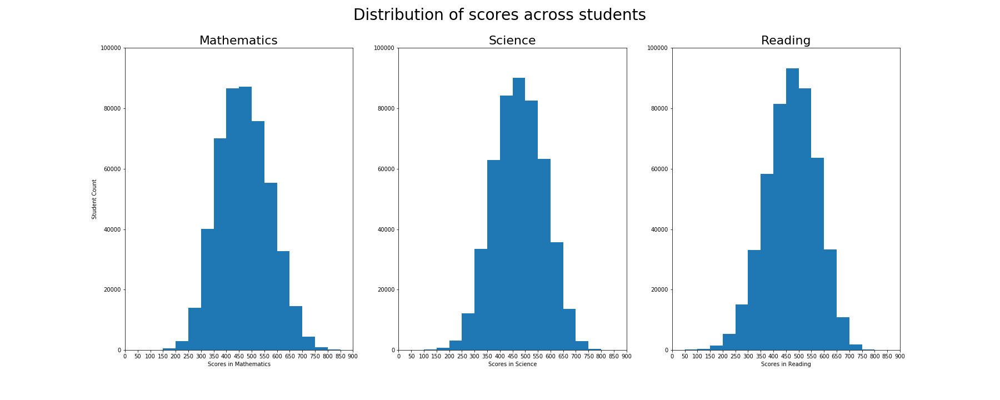
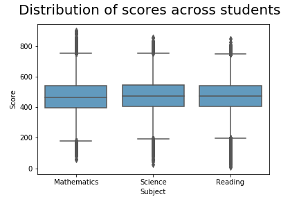
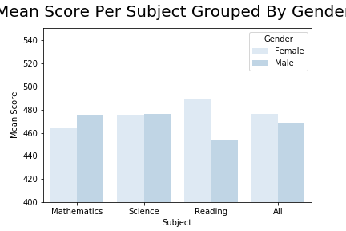
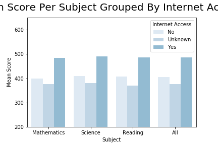
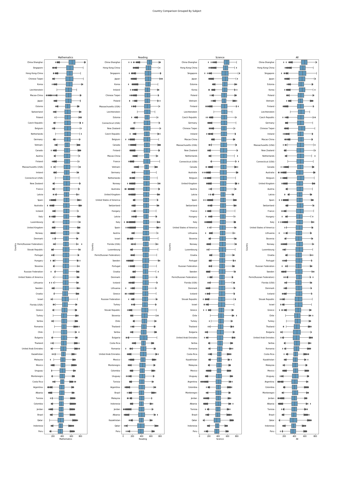
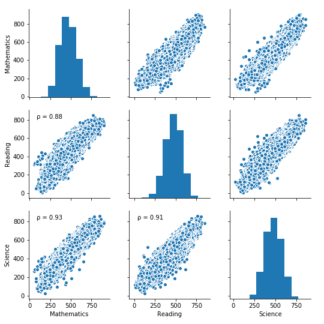

# Udacity Data Analysis Nanodegree
## Communicate Data Findings: PISA 2012

### **_by Patrick Hirschi_**

***

## Content
- [Project and dataset description](#desc)
- [Investigation](#investigation)
- [Questions](#questions)
- [Data Wrangling](#data_wrangling)
- [Univariate Exploration and Analysis](#univariate)
- [Bivariate Exploration and Analysis](#bivariate)
- [Multivariate Exploration and Analysis](#multivariate)
- [Conclusion](#conclusion)

<a id='desc'></a>
## Project and dataset description

### Pisa Programme

"The Programme for International Student Assessment (PISA) is a triennial international survey which aims to evaluate education systems worldwide by testing the skills and knowledge of 15-year-old students who are nearing the end of their compulsory education. PISA assesses how well they can apply what they learn in school to real-life situations. Over 90 countries have participated in the assessment so far which began in 2000. Every three years students are tested in the key subjects: reading, mathematics and science. In one assessment there is a focus on one of the subjects. For example in the year 2000, the focus was on reading which allowed us to get more in-depth information on the students' reading skills. In addition to the three core subjects, students are tested in an innnovative domain such as collaborative problem solving in 2015 and global competence in 2018. Some countries also choose to administer an assessment in financial literacy.
  
Not only do the students take a test, but also, they fill out a background questionnaire to provide some contextual information e.g. they are asked about the level of education of their parents and how many possessions there are in their household. In addition school principals fill out a questionnaire about how their schools are managed. This gives us insights into how the students' background and school environment could influence their performance."
  
Source: [Pisa Programme Description](http://www.oecd.org/pisa/aboutpisa/ "OECD Homepage")

### Pisa 2012

"PISA 2012 is the programme’s 5th survey. It assessed the competencies of 15-year-olds in reading, mathematics and science (with a focus on mathematics) in 65 countries and economies. In 44 of those countries and economies about 85 000 students also took part in an optional assessment of creative problem solving; and in 18 countries and economies, students were assessed in financial literacy.
  
Around 510 000 students between the ages of 15 years 3 months and 16 years 2 months participated in PISA 2012 as a whole representing about 28 million 15-year-olds globally. 
  
The students took a paper-based test that lasted 2 hours. The tests were a mixture of open-ended and multiple-choice questions that were organised in groups based on a passage setting out a real-life situation. A total of about 390 minutes of test items were covered.  Students took different combinations of different tests. They and their school principals also answered questionnaires to provide information about the students' backgrounds, schools and learning experiences and about the broader school system and learning environment."
  
Source: [Pisa 2012 Survey Description](http://www.oecd.org/pisa/aboutpisa/pisa-2012-results.htm "OECD Homepage")

***

<a id='investigation'></a>
## Investigation

Let us first just see random 10 rows of the dataset to get a quick glance.


```python
# import the necessary libraries
import pandas as pd
import matplotlib.pyplot as plt
%matplotlib inline
import numpy as np
import seaborn as sns
from scipy.stats import pearsonr

# the dataset consists of more than 600 columns and we want so see all of them
# to be sure to have all columns i will set the max value to 700
pd.set_option('display.max_rows', 700)
pd.set_option('display.max_columns', 700)

# let's import the dataset
pisa_2012 = pd.read_csv("C:\\Users\\patri\\Desktop\\Udacity\\Project5\\pisa2012.csv", 
                        encoding='latin-1', low_memory = False)
                 
# ...and import the column descriptions accordingly
pisa_2012_dict = pd.read_csv("C:\\Users\\patri\\Desktop\\Udacity\\Project5\\pisadict2012.csv", 
                        encoding='latin-1', low_memory = False)                
```


```python
pisa_2012.info()
```

RangeIndex: 485490 entries, 0 to 485489
Columns: 636 entries, Unnamed: 0 to VER_STU
dtypes: float64(250), int64(18), object(368)
memory usage: 2.3+ GB


So we have results for 485'490 children between 15 years 3 months and 16 years 2 months old from around the world. Additionally we have exactly 636 columns and the whole dataset is larger than 2.5 GB. We need to find some Questions that we want to answer and only keep the columns that are needed for the data analysis.

<a id='questions'></a>
## Questions

*I want to answer the following questions::*

* **_How well do students from individual countries perform in the observed subjects Math, Reading and Science? Therefore we want to calculate a score for each subject and student which is basically the mean value of the computed plausible values (1 to 5) for a subject._** 
    
* **_Are there countries that perform better than others?_**    
    
* **_Is there a difference between female and male students in each of the observed subjects?_**
  
* **_What is the impact of the accessibility/availability of internet on the overall performance?_**

***

<a id='data_wrangling'></a>
## Data Wrangling

We want to now clean our dataset and optimize it for the analysis of our questions. Therefore we start by selecting the relevant columns in a new dataset.

```python
# copy the dataframe before cleaning
pisa_2012_clean = pisa_2012.copy()
```
  
```python
# limit the dataset to the columns we actually need to answer our questions
pisa_2012_clean = pisa_2012_clean[['CNT', 'ST03Q02', 'ST04Q01', 'AGE', 'PV1MATH', 'PV2MATH', 
                       'PV3MATH', 'PV4MATH', 'PV5MATH', 'PV1READ', 'PV2READ', 
         'PV3READ', 'PV4READ', 'PV5READ','PV1SCIE', 'PV2SCIE', 'PV3SCIE', 'PV4SCIE', 
                       'PV5SCIE', 'ST26Q06']]
```
  
```python
pisa_2012_clean.info()
```
  
RangeIndex: 485490 entries, 0 to 485489
Data columns (total 20 columns):
CNT        485490 non-null object
ST03Q02    485490 non-null int64
ST04Q01    485490 non-null object
AGE        485374 non-null float64
PV1MATH    485490 non-null float64
PV2MATH    485490 non-null float64
PV3MATH    485490 non-null float64
PV4MATH    485490 non-null float64
PV5MATH    485490 non-null float64
PV1READ    485490 non-null float64
PV2READ    485490 non-null float64
PV3READ    485490 non-null float64
PV4READ    485490 non-null float64
PV5READ    485490 non-null float64
PV1SCIE    485490 non-null float64
PV2SCIE    485490 non-null float64
PV3SCIE    485490 non-null float64
PV4SCIE    485490 non-null float64
PV5SCIE    485490 non-null float64
ST26Q06    473182 non-null object
dtypes: float64(16), int64(1), object(3)
memory usage: 74.1+ MB
  
We want to replace the NaN values for the age of a student by the mean age in the whole dataset, afterwards we also clean up the NaN values in the ST26Q06 (Internet Access) column.

```python
# replace missing age values with the mean age in the dataset
pisa_2012_clean.loc[np.isfinite(pisa_2012_clean['AGE']) == False, 'AGE'] = pisa_2012_clean['AGE'].mean()
# replace missing internet access values with 'Unknown'
pisa_2012_clean.loc[pisa_2012_clean['ST26Q06'].isna() == True,'ST26Q06'] = 'Unknown'
```
  
Now we want to have one score for each subject to be able to visualized the results in the explanatory part later on. Therefore we will sum up the 5 plausible values for each subject and divide them by 5 to get the mean. The result should be stored in a float column.
  
```python
# compute the mean performance for each student in a specific subject and store it in a separate column
pisa_2012_clean['Mathematics'] = (pisa_2012_clean['PV1MATH'] + pisa_2012_clean['PV2MATH'] + pisa_2012_clean['PV3MATH']
                           + pisa_2012_clean['PV4MATH'] + pisa_2012_clean['PV5MATH']) / 5
pisa_2012_clean['Reading'] = (pisa_2012_clean['PV1READ'] + pisa_2012_clean['PV2READ'] + pisa_2012_clean['PV3READ']
                              + pisa_2012_clean['PV4READ'] + pisa_2012_clean['PV5READ']) / 5
pisa_2012_clean['Science'] = (pisa_2012_clean['PV1SCIE'] + pisa_2012_clean['PV2SCIE'] + pisa_2012_clean['PV3SCIE']
                              + pisa_2012_clean['PV4SCIE'] + pisa_2012_clean['PV5SCIE']) / 5
# change column types to float
pisa_2012_clean['Mathematics']=pisa_2012_clean['Mathematics'].astype(float)
pisa_2012_clean['Reading']=pisa_2012_clean['Reading'].astype(float)
pisa_2012_clean['Science']=pisa_2012_clean['Science'].astype(float)
```
  
Next we want to drop all columns that are not needed for our analysis process and also clean up the column names.
  
```python
# drop all columns that are now replaced by the new computed mean columns
pisa_2012_clean.drop(columns = ['PV1MATH', 'PV2MATH', 'PV3MATH', 'PV4MATH', 'PV5MATH', 'PV1READ',
                          'PV2READ', 'PV3READ', 'PV4READ', 'PV5READ','PV1SCIE', 'PV2SCIE', 
                          'PV3SCIE', 'PV4SCIE', 'PV5SCIE'], inplace = True)
  
# rename the columns
pisa_2012_clean.rename({'CNT' : 'Country', 
                  'ST03Q02' : 'Year Of Birth', 
                  'ST04Q01' : 'Gender', 
                  'ST26Q06' : 'Internet Access',
                  'AGE' : 'Age'
                  }, axis = 'columns', inplace = True)
```
  
Now we successfully wrangled our data to have a consistent, tidy and high-quality dataset for our analysis.

### Final dataframe


```python
pisa_2012_clean.sample(5)
```

<div>
<style scoped>
    .dataframe tbody tr th:only-of-type {
        vertical-align: middle;
    }

    .dataframe tbody tr th {
        vertical-align: top;
    }

    .dataframe thead th {
        text-align: right;
    }
</style>
<table border="1" class="dataframe">
  <thead>
    <tr style="text-align: right;">
      <th></th>
      <th>Country</th>
      <th>Year Of Birth</th>
      <th>Gender</th>
      <th>Age</th>
      <th>Internet Access</th>
      <th>Mathematics</th>
      <th>Reading</th>
      <th>Science</th>
    </tr>
  </thead>
  <tbody>
    <tr>
      <th>246168</th>
      <td>Italy</td>
      <td>1996</td>
      <td>Female</td>
      <td>15.67</td>
      <td>Yes</td>
      <td>527.50426</td>
      <td>532.35056</td>
      <td>527.35920</td>
    </tr>
    <tr>
      <th>480277</th>
      <td>United States of America</td>
      <td>1997</td>
      <td>Male</td>
      <td>15.50</td>
      <td>Yes</td>
      <td>602.82754</td>
      <td>558.37610</td>
      <td>587.59790</td>
    </tr>
    <tr>
      <th>4662</th>
      <td>Albania</td>
      <td>1996</td>
      <td>Female</td>
      <td>15.67</td>
      <td>No</td>
      <td>367.19896</td>
      <td>409.07364</td>
      <td>403.71130</td>
    </tr>
    <tr>
      <th>302490</th>
      <td>Luxembourg</td>
      <td>1996</td>
      <td>Male</td>
      <td>16.33</td>
      <td>Yes</td>
      <td>495.64574</td>
      <td>436.64084</td>
      <td>426.65052</td>
    </tr>
    <tr>
      <th>369752</th>
      <td>New Zealand</td>
      <td>1996</td>
      <td>Male</td>
      <td>16.25</td>
      <td>Yes</td>
      <td>513.71708</td>
      <td>430.54606</td>
      <td>479.98882</td>
    </tr>
  </tbody>
</table>
</div>

***

## Exploration and Analysis

<a id='univariate'></a>
### Univariate

First we want to see the distribution of scores for each of the subject and the whole dataset.


```python
plt.figure(figsize = [25, 10])

bins_hist = np.arange(0, 900 + 1, 50)

# subplot 1/3
plt.subplot(1, 3, 1)
plt.hist(pisa_2012_clean['Mathematics'], bins = bins_hist);

plt.xlim(0, 900);
plt.ylim(0, 100000 + 1);
plt.xticks(bins_hist)
plt.xlabel('Scores in Mathematics');
plt.ylabel('Student Count')
plt.title("Mathematics", fontsize=22);

# subplot 2/3
plt.subplot(1, 3, 2)
plt.hist(pisa_2012_clean['Science'], bins = bins_hist);

plt.xlim(0, 900);
plt.ylim(0, 100000 + 1);
plt.xticks(bins_hist)
plt.xlabel('Scores in Science');
plt.title("Science", fontsize=22);

# subplot 3/3
plt.subplot(1, 3, 3)
plt.hist(pisa_2012_clean['Reading'], bins = bins_hist);

plt.xlim(0, 900);
plt.ylim(0, 100000 + 1);
plt.xticks(bins_hist)
plt.xlabel('Scores in Reading');
plt.title("Reading", fontsize=22);
# set the overall title
plt.suptitle('Distribution of scores across students', fontsize=28)
# save the output as png for further use
plt.savefig('univariate_barplot_subjectscores.png')
plt.show()
```





We see the following things:
  
* _all distributions are unimodal_
  
* _the scores in each of the subjects seem to be normally distributed_
  
* _the major part of the students gets a score between 300 and 600_
  
Let us confirm on this with an additional plot. We want to do a boxplot of the data and see if there are any differences between each subject.

```python
df = pisa_2012_clean[['Mathematics','Science','Reading']]
sns.boxplot(x="variable", y="value", data=pd.melt(df),color = sns.color_palette("Blues")[3])
plt.xlabel('Subject')
plt.ylabel('Score')
# set the overall title
plt.suptitle('Distribution of scores across students', fontsize=20)
# save the output as png for further use
plt.savefig('univariate_boxplot_subjectscores.png')
plt.show()
```




All three boxes look quite the same. So there is no difference to see between the subjects (median values not significantly different). What we can observe is, that there are many outliers (points above und under the whiskers of the boxes).
  
Let's have a look at the overall performance of each country and see if there are any big differences.

```python
# get the overall mean score for each country and drop the individual subject columns
df_country_comparison = pisa_2012_clean.groupby(['Country'])[['Mathematics','Science','Reading']].mean().reset_index()
df_country_comparison['Overall Performance'] = (df_country_comparison['Mathematics'] 
                          + df_country_comparison['Science'] 
                          + df_country_comparison['Reading']) / 3
df_country_comparison.drop(columns = ['Mathematics','Science','Reading'], inplace = True)
```
```python
# get top performing countries
df_flop10_countries = df_country_comparison.sort_values('Overall Performance').head(10)
df_flop10_countries
```

<div>
<style scoped>
    .dataframe tbody tr th:only-of-type {
        vertical-align: middle;
    }

    .dataframe tbody tr th {
        vertical-align: top;
    }

    .dataframe thead th {
        text-align: right;
    }
</style>
<table border="1" class="dataframe">
  <thead>
    <tr style="text-align: right;">
      <th></th>
      <th>Country</th>
      <th>Overall Performance</th>
    </tr>
  </thead>
  <tbody>
    <tr>
      <th>47</th>
      <td>Peru</td>
      <td>375.251032</td>
    </tr>
    <tr>
      <th>50</th>
      <td>Qatar</td>
      <td>382.426012</td>
    </tr>
    <tr>
      <th>26</th>
      <td>Indonesia</td>
      <td>385.160529</td>
    </tr>
    <tr>
      <th>5</th>
      <td>Brazil</td>
      <td>392.827357</td>
    </tr>
    <tr>
      <th>31</th>
      <td>Jordan</td>
      <td>394.683219</td>
    </tr>
    <tr>
      <th>61</th>
      <td>Tunisia</td>
      <td>396.293283</td>
    </tr>
    <tr>
      <th>0</th>
      <td>Albania</td>
      <td>396.681895</td>
    </tr>
    <tr>
      <th>11</th>
      <td>Colombia</td>
      <td>403.018796</td>
    </tr>
    <tr>
      <th>1</th>
      <td>Argentina</td>
      <td>403.236725</td>
    </tr>
    <tr>
      <th>42</th>
      <td>Montenegro</td>
      <td>411.636659</td>
    </tr>
  </tbody>
</table>
</div>

```python
# get worst performing countries
df_top10_countries = df_country_comparison.sort_values('Overall Performance').tail(10)
df_top10_countries
```

<div>
<style scoped>
    .dataframe tbody tr th:only-of-type {
        vertical-align: middle;
    }

    .dataframe tbody tr th {
        vertical-align: top;
    }

    .dataframe thead th {
        text-align: right;
    }
</style>
<table border="1" class="dataframe">
  <thead>
    <tr style="text-align: right;">
      <th></th>
      <th>Country</th>
      <th>Overall Performance</th>
    </tr>
  </thead>
  <tbody>
    <tr>
      <th>38</th>
      <td>Macao-China</td>
      <td>522.702057</td>
    </tr>
    <tr>
      <th>48</th>
      <td>Poland</td>
      <td>523.177114</td>
    </tr>
    <tr>
      <th>17</th>
      <td>Estonia</td>
      <td>527.930247</td>
    </tr>
    <tr>
      <th>35</th>
      <td>Liechtenstein</td>
      <td>528.253616</td>
    </tr>
    <tr>
      <th>10</th>
      <td>Chinese Taipei</td>
      <td>534.284806</td>
    </tr>
    <tr>
      <th>30</th>
      <td>Japan</td>
      <td>540.020395</td>
    </tr>
    <tr>
      <th>33</th>
      <td>Korea</td>
      <td>542.463084</td>
    </tr>
    <tr>
      <th>54</th>
      <td>Singapore</td>
      <td>551.037344</td>
    </tr>
    <tr>
      <th>23</th>
      <td>Hong Kong-China</td>
      <td>553.520097</td>
    </tr>
    <tr>
      <th>9</th>
      <td>China-Shanghai</td>
      <td>586.541569</td>
    </tr>
  </tbody>
</table>
</div>
  
7 countries out of 10 in the top-10 country list are in Asia. The other 3 countries are European countries.
  
Next we want to investigate the performances grouped by gender. Are there any subjects that show a difference between female and male students? What about the overall performance? 
  
```python
# compute the mean scores and an overall mean
df_gender_comparison = pisa_2012_clean.groupby(['Gender'])[['Mathematics','Science','Reading']].mean().reset_index()
df_gender_comparison['All'] = (df_gender_comparison['Mathematics'] 
                          + df_gender_comparison['Science'] 
                          + df_gender_comparison['Reading']) / 3
# initiate the output dataframe
cols = ['Gender','Subject','Mean Score']
df_gender = pd.DataFrame(columns=cols)
# iterate through dataframe and set up the desired structure in new dataframe
for index, row in df_gender_comparison.iterrows(): 
    for columnname in ['Mathematics','Science','Reading','All']:
        df_gender = df_gender.append({'Gender': row['Gender'],
                                 'Subject': columnname,
                                 'Mean Score': row[columnname]}, ignore_index=True)

sns.barplot(x="Subject",y="Mean Score",hue="Gender",data=df_gender, palette=sns.color_palette("Blues"))
# set the overall title
plt.suptitle('Mean Score Per Subject Grouped By Gender', fontsize=20)
plt.ylim(400, 550 + 1);
# save the output as png for further use
plt.savefig('univariate_boxplot_gendercomparison.png')
plt.show()
```
  
  

  
Especially for the Reading test we see a big difference in favor of the female students reaching more than 30 points more! Male students seem to be slightly better in Mathematics though while for the subject Science it seems to be very balanced. The overall performance of female students still seems to be better than the one from male students.
  
Next we want to see the impact of internet access on the performance.

```python
# compute the mean scores and an overall mean
df_internet_comparison = pisa_2012_clean.groupby(['Internet Access'])[['Mathematics','Science','Reading']].mean().reset_index()
df_internet_comparison['All'] = (df_internet_comparison['Mathematics'] 
                          + df_internet_comparison['Science'] 
                          + df_internet_comparison['Reading']) / 3
# initiate the output dataframe
cols = ['Internet Access','Subject','Mean Score']
df_internet_access = pd.DataFrame(columns=cols)
# iterate through dataframe and set up the desired structure in new dataframe
for index, row in df_internet_comparison.iterrows(): 
    for columnname in ['Mathematics','Science','Reading','All']:
        df_internet_access = df_internet_access.append({'Internet Access': row['Internet Access'],
                                 'Subject': columnname,
                                 'Mean Score': row[columnname]}, ignore_index=True)

sns.barplot(x="Subject",y="Mean Score",hue="Internet Access",data=df_internet_access, palette=sns.color_palette("Blues"))
# set the overall title
plt.suptitle('Mean Score Per Subject Grouped By Internet Access', fontsize=20)
plt.ylim(200, 650 + 1);
# save the output as png for further use
plt.savefig('univariate_boxplot_internetaccesscomparison.png')
plt.show()
```


  
Wow, that is amazing. I did not expect the impact to be that big. In each of the categories we see a significant difference in favor of the students that have internet access at home.

***

<a id='bivariate'></a>
### Bivariate
  
In the bivariate part of the analysis we want to focus on the performances of different countries. Let's plot an overview figure comparing the performance of each country for each subject as well as the overall performance. All of the boxes need to be sorted descending.
  
```python
# set up the figure
plt.figure(figsize = [25, 35])
plt.subplots_adjust(wspace = 0.80) # control whitespace

pisa_2012_clean['All'] = (pisa_2012_clean['Mathematics'] 
                          + pisa_2012_clean['Science'] 
                          + pisa_2012_clean['Reading']) / 3

# set the orders descending
math_order = pisa_2012_clean.groupby('Country')['Mathematics'].mean().sort_values(ascending = False).index
reading_order = pisa_2012_clean.groupby('Country')['Reading'].mean().sort_values(ascending = False).index
science_order = pisa_2012_clean.groupby('Country')['Science'].mean().sort_values(ascending = False).index
all_order = pisa_2012_clean.groupby('Country')['All'].mean().sort_values(ascending = False).index

# subplot 1/4
plt.subplot(1, 4, 1)
sns.boxplot(x = pisa_2012_clean['Mathematics'], y = pisa_2012_clean['Country'], 
            order = math_order, color=sns.color_palette("Blues")[3]);
plt.ylabel('Country')
plt.title('Mathematics');

#subplot 2/4
plt.subplot(1, 4, 2)
sns.boxplot(x = pisa_2012_clean['Reading'], y = pisa_2012_clean['Country'], 
            order = reading_order, color=sns.color_palette("Blues")[3]);
plt.title('Reading');

# subplot 3/4
plt.subplot(1, 4, 3)
sns.boxplot(x = pisa_2012_clean['Science'], y = pisa_2012_clean['Country'], 
            order = science_order, color=sns.color_palette("Blues")[3]);
plt.title('Science');

# subplot 4/4
plt.subplot(1, 4, 4)
sns.boxplot(x = pisa_2012_clean['All'], y = pisa_2012_clean['Country'], 
            order = science_order, color=sns.color_palette("Blues")[3]);
plt.title('All');

# set the overall title
plt.suptitle('Country Comparison Grouped By Subject');
# save the output as png for further use
plt.savefig('bivariate_boxplot_countrycomparison.png')
plt.show()
```


  
China-Shanghai is in the top spot for all of the subjects and therefore also tops the overall rankings. The opposite is the case for Peru that ranks last in all of the categories.
  
***

<a id='multivariate'></a>
### Multivariate
  
First we want to further investigate the scores in each subject. We want to see if there are correlations between different subjects and therefore choose to plot a pairplot.
  
```python
# source: https://stackoverflow.com/questions/50832204/show-correlation-values-in-pairplot-using-seaborn-in-python
def corrfunc(x,y, ax=None, **kws):
    """Plot the correlation coefficient in the top left hand corner of a plot."""
    r, _ = pearsonr(x, y)
    ax = ax or plt.gca()
    # Unicode for lowercase rho (ρ)
    rho = '\u03C1'
    ax.annotate(f'{rho} = {r:.2f}', xy=(.1, .9), xycoords=ax.transAxes)

g = sns.pairplot(data = pisa_2012_clean, vars=["Mathematics", "Reading", "Science"]);
g.map_lower(corrfunc)
plt.suptitle("Scores Correlation", y = 1.02);
# save the output as png for further use
plt.savefig('multivariate_pairplot_subjectcomparison.png')
plt.show()
```


  
We see a good correlation for all of the pair plots (0.88 / 0.93 / 0.91). This means that the performance of individual students for a specific subject does not vary much compared to the performance in other subjects. The strongest correlation between the subjects is between Mathematics and Science which does not seem very surprising.
  
***

<a id='conclusion'></a>
### Conclusion
  
*Now I was able to answer all of the questions from above: *

* **_How well do students from individual countries perform in the observed subjects Math, Reading and Science? Therefore we want to calculate a score for each subject and student which is basically the mean value of the computed plausible values (1 to 5) for a subject._** 
    * _We have found that all distributions are unimodal and the scores in each of the subjects seem to be normally distributed. The major part of the students gets a score between 300 and 600. There is no difference to see between the subjects (median values not significantly different). What we can observe is, that there are many outliers (points above und under the whiskers of the boxes)._
    
* **_Are there countries that perform better than others?_**
    * _7 countries out of 10 in the top-10 country list are in Asia. The other 3 countries are European countries. China-Shanghai is in the top spot for all of the subjects and therefore also tops the overall rankings. The opposite is the case for Peru that ranks last in all of the categories._
    
* **_Is there a difference between female and male students in each of the observed subjects?_**
    * _Especially for the Reading test we see a big difference in favor of the female students reaching more than 30 points more! Male students seem to be slightly better in Mathematics though while for the subject Science it seems to be very balanced. The overall performance of female students still seems to be better than the one from male students._
  
* **_What is the impact of the accessibility/availability of internet on the overall performance?_**
    * _Maybe the biggest finding in this whole study. I did not expect the impact to be that big. In each of the categories we see a significant difference in favor of the students that have internet access at home._